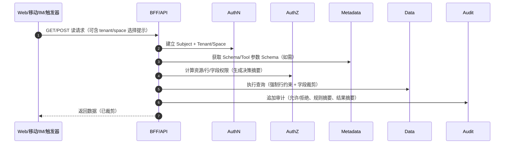
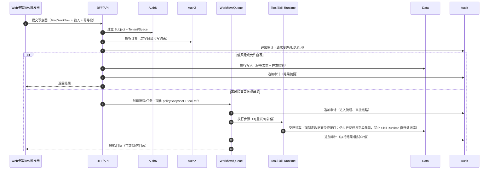

# 架构设计：元数据驱动 + 策略驱动 + AI 工具化平台

## 0. 阅读指南（如何使用本文）

- 本文先定义平台不变式：所有读写必须走同一请求链路，扩展只走契约
- 先按 MVP 落地：Schema Registry + 通用 CRUD + RBAC（资源级）+ 审计（append-only）
- 需求评审时只问三件事：新增了什么 Schema、需要什么 Tool/Workflow、对应的 Policy 与审计字段是什么
- 任何“为了方便绕开 API/审计/授权”的实现一律视为架构违规

## 0.1 细分架构设计文档索引

- [安装部署与启动（Docker Desktop）](部署与启动-DockerDesktop.md)
- [交互平面（UI）与页面配置](架构-01-交互平面-UI与页面配置.md)
- [BFF/API 与统一请求链路](架构-02-BFF与统一API请求链路.md)
- [元数据平面（Schema Registry）](架构-03-元数据平面-SchemaRegistry.md)
- [数据平面（通用 CRUD、查询、导入导出、备份恢复）](架构-04-数据平面-通用CRUD与查询.md)
- [认证与授权（AuthN/AuthZ，RBAC 起步）](架构-05-认证与授权-AuthNAuthZ与RBAC.md)
- [审计域（Audit，append-only）](架构-06-审计域-Audit与不可篡改日志.md)
- [工作流与自动化（审批、队列、幂等）](架构-07-工作流与自动化-审批队列幂等.md)
- [AI 编排层（受控工具调用与回放）](架构-08-AI编排层-受控工具调用与回放.md)
- [模型网关（路由、限流、配额、回归）](架构-09-模型网关-路由限流配额与回归.md)
- [知识层（摄取、索引、检索、证据链）](架构-10-知识层-摄取索引检索与证据链.md)
- [记忆层（偏好、长期记忆、任务状态）](架构-11-记忆层-偏好长期记忆与任务状态.md)
- [安全中枢（Safety/DLP 与内容治理）](架构-12-安全中枢-SafetyDLP与内容治理.md)
- [Skill 运行时（隔离、最小权限、出站治理）](架构-13-Skill运行时-隔离最小权限与出站治理.md)
- [连接器与密钥托管（Connector/Secrets）](架构-14-连接器与密钥托管-Connector与Secrets.md)
- [离线同步（变更日志、冲突、可回放）](架构-15-离线同步-变更日志冲突与可回放.md)
- [治理控制面（发布、灰度、回滚、评测）](架构-16-治理控制面-发布灰度回滚与评测.md)
- [渠道接入（IM/Webhook/多端入口）](架构-17-渠道接入-IM与Webhook统一入口.md)
- [多智能体协作（角色、通信、任务分配、权限上下文）](架构-18-多智能体协作-角色通信与权限上下文.md)

## 0.2 快速指引：统一标准交互与治理

- 不做“简易/治理”模式切换：系统只提供一套标准能力与一致的请求链路；界面呈现与可用操作由 RBAC/Policy 决定（不提供 uiMode 开关接口）
- 控制台入口统一：设置页聚合模型绑定、通道管理、技能列表与定时任务；具备权限的主体可进入治理控制面完成路由/配额/发布/回滚/审计等操作
- 上手路径仍然简洁：模型绑定采用引导式流程（选择提供方→录入凭证→测试），但密钥托管、限流与审计从第一天起就是默认行为（不依赖“模式”）
- 生态兼容：兼容主流开源助手的技能目录与说明风格（仅作参考示例，不引入第三方代码或商标）；必须补齐机器可读契约（输入/输出 Schema、风险等级、审批、幂等等）与发布治理；只读技能可快速启用，写入/外发技能必须走审批或灰度

## 1. 目标与范围

本平台定位为面向个人/团队/企业的超级智能体平台内核：以“元数据驱动 + 策略驱动”建模业务与数据，以 Tool/Skill + Workflow 承载能力扩展与高风险治理，并将智能体的所有行为收敛为可控的工具/流程调用，确保任何读写都经过鉴权、校验、授权、审计与内容安全治理。

产品定位与 AuthN 边界（明确对外口径）：
- 安装部署后所有人使用同一套系统能力：个人用、团队用、企业用不分“企业专属版本”
- 默认不集成企业 IdP：系统内置通用认证方案即可运行，Subject 与 tenant/space 上下文仍由认证层统一建立
- 企业身份集成作为可选插件：SSO/OIDC、SCIM 等仅作为“身份来源/供给”的可插拔 Auth Provider，不改变 AuthZ/RBAC/Audit 的治理机制与统一请求链路
- 优先补齐的底线能力：多用户主体归属、撤销与审计归属（避免共享单一管理员 token；撤销需及时生效且可追溯）

平台的核心目标：
- 用一套稳定内核承载多行业、多场景的业务建模与数据/知识/记忆操作
- 在不牺牲安全与可治理性的前提下，通过可插拔 Skill 生态实现强扩展
- 支持多入口与持续运行（对话/定时/事件/订阅），并具备可靠执行、可回放与可撤销能力
- 支持数据导入/导出、备份/恢复，并纳入权限、审批与审计护栏
- 从单体分层起步，具备清晰边界，未来可按需拆分为独立服务

### 1.1 “无限扩展/无限创造”的工程化定义与边界

“无限”在本平台语境中不是指无成本、无延迟、无安全约束地任意执行，而是指平台具备持续扩展能力边界且长期可运营：能力可以不断增长，但核心不失控、可治理链路不被绕开、可回滚可审计。

工程化定义（满足则视为“可扩展且可上线”）：
- 可表达：能力以 Schema/Policy/Tool/Workflow 之一或其组合表达，避免把业务差异写死进核心
- 可验证：输入/输出可校验，权限/字段裁剪可证明，风险级别可计算，兼容性可自动检查
- 可治理：默认拒绝，按租户/空间/环境灰度启用，支持一键禁用与回滚，变更有审计
- 可隔离：执行有明确的最小权限与资源边界（数据域/时间窗/连接器 scopes/出站策略/配额）
- 可运营：可观测（成功率、拒绝率、成本、误操作、回滚率），可回归（回放评测门槛）

硬边界（必须承认并纳入设计）：
- 资源边界：计算、存储、带宽与外部 API 配额有限，“无限”只能通过配额、降级与异步化实现可持续
- 非确定性边界：模型推理与外部系统调用天然不可复现，“可回放”必须采用与非确定性对齐的语义
 以上边界不应被隐藏，而应转化为契约字段、策略与运行时护栏的一部分

非目标（阶段性）：
- 不追求“完全自治、无约束自动执行”，默认以受控工具调用与审批/确认护栏为先
- 不追求“任意查询都高性能”，而是通过索引/投影/物化与分析侧集成逐步增强
- 不追求一开始就多服务化，优先保证边界清晰与可演进性

## 2. 关键概念

- Schema/Model：实体、字段、类型、关系、校验、展示配置等元数据定义，带版本
- Policy：资源级/行级/字段级授权与动作约束（RBAC 起步，可演进 ABAC）
- Tool/Skill：可插拔能力单元，对外暴露受控接口（读/写/需审批），由 AI 或用户触发
- Workflow：审批/状态机/异步任务编排，对高风险写操作提供“先审后改”
- Audit：不可篡改的追加式审计记录（谁在何时通过何种工具对什么做了什么）
- Backup/Restore：数据备份与恢复能力（租户/空间隔离、加密、可审计、可回放的恢复作业）

### 2.2 多语言（i18n）与默认中文

目标：
- 平台能力对多语言开放，默认中文
- 同一租户/空间可配置默认语言，同一用户可覆盖个人偏好
- 数据内容与界面文案解耦：业务数据按原文存储，展示层按语言渲染

语言优先级（从高到低）：
- 用户偏好语言（User Preference）
- 空间/组织默认语言（Space/Org Default）
- 租户默认语言（Tenant Default）
- 平台默认语言：zh-CN

适用范围：
- UI 文案：导航、按钮、字段标签、帮助提示、错误消息、通知模板
- 元数据：Schema/Tool/Workflow 的展示名称与描述（用于生成 UI 与对话提示）
- 模型输出：对话与草稿可按用户语言输出，但审计与策略字段保持结构化与可比较

契约建议：
- 所有“可展示的名称/描述”字段支持 i18n 结构：{ "zh-CN": "...", "en-US": "..." } 或 { "key": "...", "default": "...", "translations": { ... } }
- 错误码与错误消息分离：errorCode 稳定，message 支持多语言
- 通知模板按语言版本化：同一模板可有多语言变体，并受发布/灰度/回滚治理

### 2.1 术语补充（读写链路里的关键对象）

- Subject：请求主体（用户/系统/连接器主体），由认证层建立并绑定租户上下文
- Tenant/Org/Space：租户/组织/空间边界，用于隔离数据、策略、密钥与同步范围
- Resource/Action：授权计算的基本单元（对什么资源做什么动作）
- Effective Schema：按字段级权限裁剪后的 Schema 视图，前端只消费这个版本
- Policy Snapshot：某次执行时刻固化的授权快照，用于回放一致性与可解释审计
- ToolRef：工具名称 + 版本 + 依赖摘要，执行与回放都必须可定位到同一版本
- IdempotencyKey：写操作幂等键，贯穿对话/审批/执行与重试去重
- Run/Step：一次任务执行与其步骤单元，用于可靠执行、重试、补偿与审计串联
- Connector/SecretRecord：外部系统接入与凭证托管对象，凭证只可受控读取与可审计使用

## 3. 总体架构（单体分层，服务化可拆）

建议先以单体分层（模块化单仓）落地，每个模块对外暴露清晰接口与数据模型；当吞吐、隔离或团队规模达到阈值，再拆成独立服务。

### 3.1 边界与调用约束（避免功能架构冲突）

为确保“元数据驱动 + 策略驱动 + 工具化”在未来演进为超级智能体时仍可无穷扩展且不失控，需要在第一天把边界固化为平台不变式：
- 唯一写入口：所有读写（UI、AI、第三方集成、定时/事件触发）必须经过同一 API 层，不允许绕过鉴权/校验/授权/审计直接访问数据层或数据库
- 唯一鉴权源：请求主体（Subject）与租户上下文（Tenant/Org）只由认证层建立，禁止由上层“自带身份”传入
- 客户端上下文不可被信任：客户端可携带 tenant/space 的选择提示，但最终以认证层绑定的 tenant/space 为准（用于缓存键、审计归属与数据访问裁剪）
- 策略先于执行：授权计算必须在执行前完成，并产出可解释决策与可复用的权限快照（Policy Snapshot）
- 审计不可跳过：任何成功或失败的操作都必须产生审计记录（至少记录拒绝原因/命中规则摘要）
- 扩展只走契约：扩展能力只能以 Tool/Skill、Schema、Policy、Workflow 形式接入；不得在核心之外引入“旁路读写通道”

模块划分：
- Web/UI（Next.js）
  - 基于 Schema 自动生成列表/详情/表单/搜索
  - 固定组件库，页面由 Schema 组合
  - 只消费经授权裁剪后的 Effective Schema（避免前端拿到不可见字段元数据）
- BFF/API（Fastify 起步；如需强 DI/装饰器生态可用 NestJS）
  - 统一鉴权、限流、审计、版本、错误规范
  - 面向前端提供稳定 API，并对下游模块做聚合与适配
- Metadata（平台大脑）
  - Schema Registry：实体/字段/关系/校验/展示配置
  - Schema 版本管理、兼容规则、迁移策略定义
- Data（平台数据面）
  - 按 Schema 做通用 CRUD、查询、导入导出、备份与恢复
  - 强制字段校验与权限过滤（行级/字段级）
- AuthZ（策略面）
  - Tenant/Org/User/Role/Permission/Policy
  - 资源级授权，可演进到 ABAC；支持策略解释与缓存
- Workflow/Automation（流程面）
  - 流程定义、审批、状态机、异步任务
  - 建议队列 BullMQ 起步，统一重试/幂等/死信策略
- AI Orchestrator（对话面）
  - 工具/Skill 注册表、工具参数 Schema、执行沙箱
  - 工具调用的审批、回放与审计
- Model Gateway（模型面）
  - 多模型接入、路由、降级与熔断
  - 速率限制、配额与成本归集（用于治理与预算控制，不用于计费）
  - 统一绑定模型提供方 API（云端/自建），凭证走 Secrets/Connector 托管并可审计
- Knowledge（知识面）
  - 文档/内容摄取、索引、检索与证据引用
  - 与 AuthZ 复用租户隔离、行级/字段级裁剪
- Memory（记忆面）
  - 长短期记忆分层存储、可见可控与生命周期治理
  - 任务状态与计划产物的持久化与可恢复
- Safety/DLP（安全中枢）
  - 提示注入防护、敏感信息识别、脱敏与外发策略
  - 工具入参/出参与日志摘要的统一内容治理
- Skill Runtime（执行沙箱）
  - Skill 执行隔离与最小权限（进程/容器/远程均可）
  - 出站网络、资源配额、超时、并发与熔断治理
- Device Runtime（本机执行端 / Device Agent，可选扩展能力）
  - 将“桌面/移动端设备能力”纳入受控工具调用：浏览器/桌面自动化、文件与外设能力等
  - 设备级最小权限、白名单与本机确认闸门，结果与证据回传并进入审计
- Governance/Admin（控制面）
  - 组织/空间管理、策略与配置变更治理、审计导出
  - Schema/Policy/Workflow/Skill 的发布、灰度与回滚

### 3.1.1 接入底座（Integration Gateway）能力（按需平台化）

大多数第三方系统只要提供标准 HTTP API，即可由个人/企业通过 Connector + Skill 自行适配。但当大量系统重复依赖同一类“接入基础能力”时，将其平台化为通用底座更划算，可显著降低接入成本并提升安全一致性。

典型平台级接入底座能力：
- OAuth 回调托管：统一 redirect/callback 入口、多租户隔离、state/nonce 校验、token 交换与刷新、回调审计
- Webhook 接入网关：验签/解密、重放防护、事件幂等去重、限流与队列化投递、失败重试与死信
- 订阅与长连接运行器：长轮询/WebSocket/Streaming 订阅的断线重连、水位推进、背压与容量治理
- 通用协议连接器：IMAP/SMTP/Exchange 等协议的连接管理、增量拉取、水位与去重、附件处理与审计对齐

平台化判定（建议）：
- 跨多个系统重复出现且实现容易不一致
- 一旦做错会产生安全或合规风险（回调验签、解密、凭证刷新、事件重放）
- 需要稳定的可观测与可运营能力（重试、死信、堆积、配额命中）

### 3.1.2 本机执行端（Device Runtime / Device Agent）

阶段声明：
- 本机执行端属于“端侧/设备入口”的可选扩展能力：已落地 Device Agent 配对/心跳、DeviceExecution 下发/领取/回传、设备策略与审计对齐，用于把端侧能力纳入统一受控链路。
- 已从“示例执行器（noop/echo）”扩展到“真实端侧能力（最小集合）”：文件、浏览器、桌面能力以明确命名空间收敛为 `device.file.* / device.browser.* / device.desktop.*`，并全部受 DevicePolicy 能力包络约束。
- 平台侧与端侧双重校验：创建 device execution 时按工具版本 `inputSchema` 校验 input；device-agent 领取时同时下发 policy 与 policyDigest，端侧执行前再次强制校验 allowedTools/filePolicy/networkPolicy/uiPolicy/limits。
- 证据能力纳入统一产物体系：device-agent 可在 `evidencePolicy` 放行时上传证据产物（截图/文本/JSON 摘要等）进入 artifacts，并通过 `evidenceRefs` 与执行记录/审计摘要关联。
- 仍保持“默认拒绝 + 白名单 + 可审计 + 无任意脚本/命令执行”的不变式：高风险动作要求 `requireUserPresence`，输出默认仅返回摘要（digest），避免端侧敏感明文回传。

动机：
- 服务器部署的智能体平台只能直接操作“服务器所在环境”与“可通过网络访问的系统”。当任务需要使用用户设备的能力（本机文件、浏览器登录态、桌面软件、手机相机/扫码/定位、硬件令牌等）时，需要在设备侧提供受控运行时。
- 本机执行端的目标不是提供无限制远程桌面，而是把设备能力收敛为 Tool/Skill 的受控执行：仍遵守统一链路（鉴权→校验→授权→执行→审计），并在设备侧强制最小权限与本机确认闸门。

适用场景（示例）：
- 仅有网页后台、无开放 API 的系统：登录后填报、上传下载、提交回执
- 仅有客户端/老系统：导出报表、批量录入、截图留证
- 需要设备侧能力：读取指定目录文件、调用本机证书/硬件令牌、手机拍照/扫码上传

位置与边界：
- 本机执行端属于 Skill Runtime 的一种落地形态（remote/device），由平台调度执行，但运行在用户设备上。
- 本机执行端不直接访问平台数据库；不接受任意脚本/命令的旁路执行；只能执行已注册的 toolRef（带版本与依赖摘要）及其 input/output schema。

Device Runtime Contract（概念级最小集合）：
- DeviceRecord：{ deviceId, ownerScope(user/space), spaceId?, deviceType(desktop/mobile), os, agentVersion, status, enrolledAt, lastSeenAt }
- DevicePolicy（设备能力包络）：{ allowedTools?, filePolicy(allowedRoots, allowRead, allowWrite, maxBytesPerRead, maxBytesPerWrite), networkPolicy(allowedDomains), uiPolicy(allowedApps?, allowClipboard?), evidencePolicy(allowUpload, allowedTypes, retentionDays), limits(timeoutMs, maxConcurrency) }
- DeviceExecutionRequest：在 ExecutionRequest 基础上增加 deviceRef：{ toolRef, subject, scope, input, policySnapshot, idempotencyKey, limits, deviceRef, requireUserPresence? }
- DeviceExecutionResult：{ output, outputDigest, status, errorCategory, latencyMs, evidenceRefs?, egressSummary }

安全与治理要点（结构性要求）：
- 设备注册与配对：一次性配对码 + device token（可演进到设备证书/mTLS）；可随时 revoke/disable，撤销动作进入审计
- 最小权限：默认以非管理员权限运行；文件/应用/域名白名单；剪贴板与屏幕采集策略按风险分级
- 本机确认闸门：对提交表单、外发消息、删除/批量操作等高风险动作要求本机弹窗确认或双人审批后放行
- 凭证边界：优先使用系统钥匙串/安全区；平台与 Skill 不应获得凭证明文；仅允许在受控调用路径中使用
- 证据回传与审计：关键步骤产出 evidenceRefs（截图/回执/日志摘要），与 toolRef、policySnapshot、idempotencyKey 绑定，支撑回放与追责

### 3.3 平台“平面”能力架构（从模块到可拆分边界）

为支撑“个人/团队/企业都可用”的长期运行超级智能体，建议把模块再抽象为可拆分的能力平面（Plane），保证未来服务化拆分仍遵守平台不变式：
- 交互平面（Channel Plane）：Web/UI、多端入口（移动/桌面/IM/语音）、通知/触达（Push/邮件/短信等）、Webhook/订阅入口、端侧/设备入口（可选）
- 控制平面（Governance Plane）：AuthN/AuthZ、Safety/DLP、Governance/Admin、发布与变更治理、可观测与评估
- 数据平面（Data Plane）：Metadata/Data/Audit、导入导出、投影/索引/物化、分析侧对齐授权
- 智能平面（Intelligence Plane）：AI Orchestrator、Model Gateway、Knowledge、Memory（上下文/记忆/任务状态）
- 执行平面（Execution Plane）：Workflow/Automation、队列与重试、Skill Runtime（隔离与资源治理）、幂等与可回放执行

### 3.2 UI 产品形态与扩展策略（三层叠加）

平台 UI 以“三层叠加”为主架构，以确保高交付效率与可治理性，同时保留无限扩展的专业交互能力：
- 可生成的通用业务 UI：面向大多数实体的列表/详情/表单/搜索/导出，直接由 Schema + Policy 驱动生成
- 可定制的业务页面：对少数关键业务域提供定制页面与交互，但数据读取/写入仍走同一 API 与审计链路
- 可插拔的专业工作台：对 编辑器、流程画布、BI 分析台、运营工作台等复杂交互，以插件形式提供独立工作台

“可视化搭建任意页面”应作为专业工作台或可定制页面的一种实现形态，而非主路径。其治理边界必须与平台不变式一致：
- 组件白名单：仅允许使用平台内置或审核通过的组件库
- 受控数据源：数据绑定只能调用平台 API，不允许直连数据库或绕过授权
- 受控动作：用户操作只能映射为受控 Tool/Workflow，不允许注入任意脚本绕过权限与审计
- 版本与发布：页面配置与依赖（组件/工具版本）需要版本化，支持灰度与回滚

#### 3.2.1 手机端与多端 UI（同一能力内核，多端呈现）

原则：
- 多端入口一致：Web/移动/桌面/IM 都属于 Channel Plane，只负责交互与展示，不承载业务读写旁路
- 能力复用：手机端复用同一 Schema/Policy/Tool/Workflow/Audit，不复制权限与业务规则
- 体验分级：通用 CRUD 优先统一生成；高频关键路径在手机端单独做交互与信息密度设计；复杂工作台在手机端提供轻量模式

落地策略（按成本从低到高）：
- 响应式 Web：优先覆盖大多数通用业务 UI（列表/详情/表单/搜索），同一页面配置支持 mobile/desktop 布局变体
- 原生/小程序：当需要系统能力（推送、离线、相机、分享、深链、后台任务）或更强体验时，做独立客户端壳，但仍只调用平台 API
- 专业工作台：桌面端提供完整能力；手机端提供“查看 + 轻编辑 + 快捷动作 + 审批/回执”，重交互能力按需拆为独立工作台

#### 3.2.2 自由定义页面（个人/企业都可配置，但必须可治理）

目标：
- 每个租户/组织/空间都可定义自己的页面与导航
- 页面配置可版本化、可灰度、可回滚，并纳入审计与变更治理
- 页面配置不允许引入旁路读写与任意脚本执行

页面配置契约（建议作为 Channel/Notification Contract 的一部分）：
- PageTemplate：页面模板（组件树/布局/数据绑定/动作映射），支持版本与兼容规则
- ComponentRegistry：组件注册表（白名单 + 版本），组件必须声明输入属性 Schema 与安全边界
- DataBinding：受控数据绑定（只允许调用平台 API，绑定必须声明 resource/action 并受字段级裁剪）
- ActionBinding：受控动作映射（只允许映射到 Tool/Workflow，必须声明风险等级与是否需要确认/审批）
- LayoutVariants：同一页面配置可包含 mobile/desktop 变体（断点布局与信息密度策略）

发布与治理：
- 变更入口：页面配置变更视为治理变更，进入发布流程并写入审计
- 权限控制：只有具备治理权限的主体可发布页面配置，租户/空间级隔离
- 风险门槛：涉及写动作的页面配置默认需要审查或双人复核，并支持灰度与回滚
- 运行时防护：渲染层强制执行组件白名单、数据源限制、动作映射限制与版本锁定

#### 3.2.3 个人级界面偏好（只影响自己，不走发布）

目标：
- 员工可自定义自己的布局与展示偏好，不影响同租户的其他人
- 同一用户可按端保存不同偏好（desktop/mobile），并支持跨端同步与一键重置
- 不引入任何旁路读写能力，偏好只改变展示与交互，不改变权限与数据范围

个人偏好契约（建议）：
- UserViewConfig：{ userId, scope(tenant/space), target(page/entity/viewId), variant(desktop/mobile), layout, visibleFields, sort, filters, shortcuts, version }
- PersonalDashboard：个人首页/快捷入口集合（本质是若干 target + shortcut 的组合）

约束：
- DataBinding 与 ActionBinding 仍必须受控：只能使用平台允许的绑定与动作映射，且受字段级裁剪与权限约束
- 默认不需要治理审批：偏好保存属于低风险写入，但仍可做轻量审计（谁在何时修改了自己的配置）
- 可配额与限流：避免偏好频繁写入导致存储与同步压力

## 4. 数据存储与建模策略

推荐技术栈：
- PostgreSQL + JSONB
  - 元数据（Schema/Policy/Workflow/Tool）走强结构表
  - 业务数据采用“统一表 + JSONB payload”或“按域拆表 + JSONB 扩展字段”
- Redis
  - 缓存、会话、限流、队列状态
- 审计日志存储（强烈建议独立逻辑域）
  - 最少做到 append-only（不可更新/删除；只追加）

业务数据建模建议：
- 统一表 + JSONB 适合冷启动与快速扩展
- 对高频查询字段提供“投影列/生成列/索引策略”能力（由 Schema 配置）
- 对热点实体逐步引入按域拆表或物化视图，以保证查询与统计能力

### 4.1 复杂报表与分析（BI/OLAP）集成

跨大量维度的统计、实时分析与 OLAP 往往需要数仓/列存/预聚合能力，建议按“可演进集成”落地：
- 早期：基于 PostgreSQL 物化视图/汇总表做预聚合，配合增量刷新任务
- 进阶：引入分析型存储（列存/数仓）承载大宽表、多维聚合与高并发报表查询
- 同步方式：批处理 ETL/ELT 或 CDC 增量同步，将业务库的变更投递到分析侧
- 语义层：将 Schema 与指标口径（维度/度量/时间粒度）做成可版本化元数据，避免口径漂移
- 权限一致：分析侧查询需复用平台的租户隔离与行级/字段级授权（至少做到租户与组织层级约束）
- 可追溯：报表查询与导出同样进入审计（谁在何时导出了什么口径的数据）

## 5. 核心请求链路（不变式）

平台所有读写必须满足同一条安全链路：

1) 鉴权（Authentication）
- 识别用户与租户上下文，建立请求主体（Subject）

2) 参数校验（Validation）
- 基于 Schema/Tool 参数 JSON Schema 校验输入

3) 授权计算（Authorization）
- 计算资源级/行级/字段级权限
- 输出可解释决策（允许/拒绝原因），并支持缓存

4) 业务执行（Execution）
- 读：强制字段级过滤与查询约束
- 写：强制字段级写入约束、幂等键、并发控制策略

5) 审计落库（Audit）
- 追加式记录：主体、动作、资源、工具、参数摘要、结果摘要、审批链路、幂等键
- 同步边界：写请求与高风险读（导出/下载/密钥使用）审计写入失败视为请求失败；低风险读可进入可靠队列补偿，但必须保证最终落库与可追踪

### 5.1 读请求端到端（示意）

### 5.2 写请求端到端（含审批/异步示意）

### 5.3 失败与恢复（约定）

- 授权拒绝必须可解释：返回拒绝原因与命中规则摘要，并写入审计
- 工具/连接器失败必须可分类：可重试/需人工/需审批/需降级，并体现在 Workflow 的重试与死信策略
- 审计失败必须可追踪：同步失败即请求失败，或进入可靠队列补偿但必须可定位到原请求与 trace
- 回放语义必须明确：回放用于复盘、审计与回归评测，默认重放已记录的决策轨迹与结果摘要；对模型/外部系统不承诺“重新执行即可得到相同结果”

## 6. Schema 版本与迁移策略

Schema 演进是平台的首要复杂度来源，应在第一天明确规则：

- 版本语义：至少区分兼容变更与非兼容变更
- 兼容原则（建议默认）：
  - 新增可选字段：兼容
  - 新增必填字段：需要迁移/默认值策略
  - 字段类型变更：视为非兼容，需迁移策略与回滚预案
  - 删除字段：先废弃（deprecate），后移除；读写均需兼容窗口
- 迁移执行策略：
  - 惰性迁移：读写时自动升级 payload（配合版本标记）
  - 在线迁移：后台任务批量回填（需要限速与可恢复）
  - 双写/回填：对关键字段提供短期双写保证一致

## 7. 授权模型（RBAC 起步，演进 ABAC）

推荐最小可行授权模型：
- RBAC：Role -> Permission，Permission 作用于 Resource + Action
- 资源级：是否允许访问某实体/接口/工具
- 行级：对记录级的访问约束（如 owner、组织层级、项目成员等）
- 字段级：
  - 读字段白名单/黑名单
  - 写字段白名单/黑名单
  - 在导出、搜索、AI 工具参数映射中同样生效

策略治理建议：
- 策略计算可缓存（基于租户/用户/角色/上下文哈希）
- 缓存必须可失效：角色/权限/策略变更、成员关系变更、组织层级变更时应主动失效或版本递增
- 决策可解释（输出命中规则与拒绝原因），便于排障与合规审计

## 8. Workflow 与高风险操作治理

原则：
- 高风险写操作默认走 Workflow（审批/双人复核），而不是直接提交

落地建议：
- 将“工具是否需要审批”作为 Tool/Skill 元数据的一部分
- 将“审批通过后的执行”作为可回放的事务：同一幂等键、同一输入摘要、同一权限上下文
- 对队列任务提供：
  - 重试策略与退避
  - 死信队列与人工处置入口
  - 幂等去重与可观测性指标

## 9. AI Orchestrator：对话到受控工具调用

AI 的价值在于“把意图变成操作”，但平台必须把 AI 的操作边界收敛到工具层：

- AI 只能调用注册的 Tool/Skill
- Tool/Skill 必须声明：
  - 作用域：读/写
  - 资源类型与动作
  - 参数 JSON Schema
  - 返回 JSON Schema（用于校验、脱敏与兼容性检查）
  - 是否需要审批与风险级别
  - 速率限制与配额（租户/用户维度）
  - 幂等要求（写操作必须提供或由系统生成幂等键）
- 每次工具调用都必须经过：
  - 鉴权 → 参数校验 → 权限计算（字段级）→ 幂等/去重 → 审计落库

为了支持“可回放 + 可追责 + 可治理”的超级智能体能力，建议把每次工具执行的上下文固化为可序列化对象：
- Subject/Tenant：主体与租户上下文
- ToolRef：工具名称+版本+依赖摘要
- InputDigest/OutputDigest：输入输出摘要（可配置脱敏规则）
- PolicySnapshot：执行时刻的授权快照（用于回放一致性与合规审计）
- IdempotencyKey：写入幂等键（审批通过后复用同一键）

### 9.1 回放与确定性边界（必须前置约束）

回放用于复盘、追责与回归评测，其目标是重建“当时为何这么做、做了什么、结果是什么”，而不是保证“再跑一遍世界得到同样结果”。

建议将执行结果按确定性分层：
- 内部确定性写入：对平台自身数据域的写入，以幂等键与变更日志/补丁为最终事实；回放以重放变更序列与校验摘要为准
- 外部系统副作用：对外部 API 的写入与读取，回放以记录的请求摘要、响应摘要与关键证据为准；允许在新的 Run 下重新执行，但必须生成新的审计链路并明确标记为 re-exec
- 模型推理：回放以“当时使用的模型路由、提示模板版本、工具选择与输出摘要”为准；不承诺输出可复现，只承诺轨迹可解释与可评估

为使回放具备工程可操作性，建议对每次工具调用补齐以下约束：
- 结果封存：对非确定性结果保留可配置的证据（摘要为默认，必要时加密存储原文并配置保留期）
- 复盘可比：关键产物输出结构化摘要，支持回归集对比与阈值门槛
- 旁路禁止：任何能产生副作用的动作必须经由 Tool/Workflow，确保轨迹可重建

### 9.2 模型绑定与密钥托管（统一标准）

- 绑定体验：控制台采用引导式流程完成模型绑定与连通性测试
- 托管与护栏：密钥一律走 Secrets/Connector 托管（加密、最小授权、轮换与撤销、使用可审计），并默认启用基础限流与审计摘要
- 治理能力：路由/降级链路、配额/并发/超时、发布/灰度/回滚等能力始终存在，但仅对具备相应治理权限的主体开放（由 RBAC/Policy 决定）
- 使用面透明：对话与任务界面可展示当前模型与路由摘要（可选），所有调用进入统一链路并写入审计与可回放摘要

## 10. Skill 扩展机制：实现“无限可能”的可治理路径

“无限可能”应理解为：在稳定内核与严格护栏之上，通过可插拔 Skill 持续扩展能力边界，而不是让核心无限膨胀。

面向“OpenClaw 式生态”（生态级插件市场 + 本地化/私有化运行 + 大量第三方技能复用）的关键要求：
- Skill 规范兼容：兼容 AgentSkills 风格的 SKILL.md 目录结构与元数据规范
- 运行时隔离：Skill 执行与核心服务隔离，默认最小权限与受控资源访问
- 安装更新治理：Skill 来源可信、版本锁定、签名/扫描、灰度发布与可回滚

### 10.0 用户私有自举 Skill（Self-Bootstrapping）

目标：
- 当对话任务缺少所需工具能力时，允许智能体在“用户授权范围内”生成并启用私有 Skill，用于完成该用户自己的任务
- 任何自举扩展不得破坏平台不变式：扩展只走契约、默认拒绝、可审计可回放、最小权限

### 10.3 安装体验与治理分层

- 只读低风险技能：兼容目录与说明，补齐最小契约字段后即可一键启用（自动校验与审计）
- 写入/外发技能：在安装启用时执行签名/依赖扫描与风险分级，按租户/空间灰度与审批；执行默认绑定幂等键与审计事件
- 运行时隔离：统一声明并强制执行并发/超时/速率限制与出站白名单，禁止旁路读写与未声明的网络访问

边界声明：
- 自举 Skill 的作用域必须是 user（或 user+space），不得自动升级为 tenant/org/global 共享能力
- 自举 Skill 不等于“随意写代码上线”：只能通过受控的 Skill Draft/Publish 流程落库与启用，并受静态检查、版本锁定与运行时隔离约束

落地准则（优先顺序）：
- 声明式优先：优先生成可验证的声明式 Skill（连接器调用、数据映射、分页/重试、检索管道、工作流编排），减少可执行代码面
- 受控代码其次：确需代码时，限制到少数受控运行时与依赖形态（可重复构建、依赖锁定、签名/扫描），并严格绑定最小权限与资源配额
- 能力包络固定：每个自举 Skill 必须声明并被强制执行 capability envelope（可访问的数据域、允许的出站目标、可用 secrets 范围、CPU/内存/并发/超时上限）

生命周期（建议）：
- draft：仅生成草稿与元数据，不可执行或仅允许 dry-run
- enabled_user_scope：仅对该用户/空间启用，可执行但必须受配额/限流/出站治理
- disabled/revoked：随时禁用与回滚，禁用动作本身写审计

触发策略（建议）：
- 智能体检测“缺少能力”后，可自动生成 draft，并返回 needs_confirmation/needs_approval 回执
- 涉及外发、批量写入、连接器凭证的能力默认需要确认或审批；低风险只读能力可配置允许自动启用
- 默认限制：自举 Skill 默认禁止外发与连接器 scopes 扩张；如需外发或使用凭证，必须显式声明并进入审批

契约要求：
- 自举 Skill 仍必须完整声明 Tool Contract（input/output schema、riskLevel、approvalRequired、rateLimit/quota、idempotency）
- 运行时必须满足 Runtime Contract（出站默认拒绝、最小权限、超时与并发限制）
- 每次执行必须绑定 policySnapshot、toolRef、inputDigest/outputDigest 与 idempotencyKey，并写入审计

### 10.1 稳定契约（支撑无穷扩展的“硬边界”）

要做到“能力无穷尽开发”但核心仍可治理，必须把可扩展点收敛到少数稳定契约，并对这些契约做版本化与兼容性规则：
- Schema Contract：实体/字段/关系/校验/展示配置的 DSL 与版本语义
- Policy Contract：资源/行/字段授权的表达方式、解释器接口与决策输出格式
- Tool Contract：工具元数据、入参/出参 Schema、风险等级、审批配置、速率/配额、幂等要求
- Workflow Contract：审批与状态机的定义格式、可回放的执行单元与补偿语义
- Audit Contract：审计事件字段集合、脱敏策略、不可变约束与完整性校验方式
- Channel/Notification Contract：多端入口与通知/触达的类型、模板、交互回执、撤销/重试语义与审计字段集合
- Model Contract：模型路由策略、输出约束、版本语义与回归评估接口
- Knowledge Contract：知识摄取与索引元数据、检索接口、证据引用与可追溯格式
- Memory Contract：记忆分层与生命周期、可见可控操作与审计字段集合
- Safety Contract：内容风险分级、敏感信息规则、脱敏与外发策略接口
- Sync Contract：离线优先的变更日志、冲突解决、端侧缓存/加密、增量同步与可恢复语义
- Media Contract：多模态素材的对象存储、处理流水线、溯源/版权/水印元数据与内容治理接口
- Secrets/Key Contract：凭证与分区密钥、加密域、轮换/撤销/恢复流程与审计字段集合
- Runtime Contract：隔离边界、最小权限、出站治理、资源配额与超时策略
- Release/Eval Contract：兼容性检查、灰度/回滚、回放评估与准入门槛的元数据格式

契约表面收敛原则（避免“契约无限膨胀”反噬扩展速度）：
- 稳定字段尽量少：每个契约只保留跨域必需的稳定字段集合，其余放入明确的扩展命名空间
- 未知字段可前向兼容：解析器对未知扩展字段默认忽略但保留，避免小变更触发全量升级
- 语义版本化而非仅字段版本化：对行为变化以版本语义与兼容检查表达，禁止“同名字段语义漂移”
- 自动化准入优先：兼容性检查、风险评估与回放评测作为发布门槛，减少人工审查成为扩展吞吐瓶颈

约束性原则：
- 核心只演进契约与护栏，不承载“无限业务逻辑”；业务差异通过 Schema/Policy/Tool/Workflow 表达
- 新能力优先做成 Tool/Skill，其次做成 Policy/Workflow 扩展，最后才考虑进入核心

### 10.2 契约最小字段（MVP）

- Schema Contract（最小集合）
  - name、version、entities、fields（type/required/validation）、relations、uiHints、projections/indexes
  - fieldVisibility：字段级读/写可见规则（用于生成 Effective Schema）
- Policy Contract（最小集合）
  - principals（user/role/group）、bindings（roleBinding）、permissions（resource+action）
  - rowFilters（按空间/成员/owner 等表达）、fieldRules（read/write allow/deny）
  - decision：允许/拒绝、命中规则摘要、可解释原因
- Tool Contract（最小集合）
  - name、version、scope（read/write）、resourceType、action
  - inputSchema、outputSchema、riskLevel、approvalRequired
  - rateLimit/quota、timeouts、idempotency（required/strategy）
- Workflow Contract（最小集合）
  - name、version、trigger（toolRef/事件/定时）、approvalSteps
  - executionPlan（steps）、retryPolicy、deadLetterPolicy、compensation（可选）
  - serialization：policySnapshot、toolRef 锁定、inputDigest 绑定
- Audit Contract（最小集合）
  - eventId、timestamp、subject、tenant/space
  - action、resourceRef、toolRef、policyDecisionSummary
  - inputDigest、outputDigest、idempotencyKey、result（success/denied/error）、traceId
- Sync Contract（最小集合）
  - op（opId/clock/baseVersion/type/payload）、cursor/watermark
  - push/pull 返回 accepted/rejected/conflicts 与 nextCursor
- Secrets/Key Contract（最小集合）
  - secretRecord（ownerScope、connectorRef、encryptedPayload、keyVersion、status）
  - rotation/revoke：轮换与撤销语义，以及每次使用的审计事件字段集合

落地细化（建议）：
落地细化（建议）：
- Skill 包格式：统一目录结构、清晰的能力声明、版本与兼容信息、配置项声明
- Skill 注册表：支持发布、检索、评分/标签、依赖关系、版本分发与回滚
- 运行策略：超时、并发上限、速率限制、网络访问控制、资源配额（CPU/内存）
- 安全检查：静态扫描、依赖风险扫描、签名校验、允许列表与风险分级
- 企业分发：内网私有 Registry、租户/组织级启用、灰度与审批联动

面向“通用大智能体”（工作/生活/娱乐）的产品化建议：
- 能力来源统一化：所有能力都以 Tool/Skill 暴露，避免绕过鉴权、授权与审计
- 交互入口多样化：Web、移动端、桌面端、IM/语音入口均映射到同一对话与工具编排层
- 触发机制体系化：支持用户主动请求、定时触发、事件触发（Webhook/队列）与订阅式自动化
- 记忆与偏好可治理：将用户偏好、长期记忆、任务状态作为可版本化数据，支持查看、编辑与清除
- 自治等级可配置：按场景配置“只建议/需确认/自动执行（可回滚）”，高风险写入默认审批
- 隐私分区与隔离：工作与个人数据空间隔离，Skill 仅能访问被授权的数据域与时间范围
- 场景扩展路径：工作（邮件/日历/文档/任务/报表）→ 生活（出行/账本/家庭协作/智能家居）→ 娱乐（媒体/内容创作/游戏助手）

Skill/Tool 接入规范（建议）：
- 可发现：注册表中可查询（名称、版本、能力、作用域、风险、启用租户）
- 可验证：参数与返回都有 Schema，支持自动校验与兼容检查
- 可授权：每个 Skill 都映射到资源与动作，纳入统一 AuthZ
- 可治理：
  - 默认拒绝，按租户/环境灰度启用
  - 需要审批的写操作必须进入 Workflow
  - 支持配额、限流、并发上限、超时、重试与熔断
- 可审计：每次执行可回放（输入/输出摘要、版本、依赖、执行耗时、错误）

执行隔离（建议）：
- 将 Skill 运行时与核心隔离（进程/容器/远程调用均可），以降低供应链风险
- 强制最小权限：Skill 只能通过受控接口访问数据，不允许直连数据库

## 11. 可观测性与质量保障

最低要求：
- 指标：请求量、延迟、错误率、授权拒绝率、工具调用成功率、审批耗时
- 追踪：请求级 trace，串联 UI/BFF/Data/AuthZ/Workflow/Tool
- 告警：队列堆积、死信增长、审计写入失败、授权异常波动
- 变更吞吐：发布次数、回滚次数、兼容检查失败率、回放评测失败率、平均发布周期（用来衡量生态扩展速度是否被治理卡住）

## 12. 演进路线（建议）

- MVP：Schema Registry（含版本）+ 通用 CRUD（含校验）+ RBAC（资源级）+ 审计（append-only）
- V2：字段级/行级授权 + 导入导出 + 基础 Workflow + 队列任务（幂等/重试/死信）
- V3：AI Orchestrator（工具注册、审批、回放）+ ABAC/策略表达增强 + 查询投影/物化能力增强

## 13. 关键架构决策清单（建议沉淀为 ADR）

- 业务数据采用统一表+JSONB 或按域拆表+JSONB 的取舍与演进阈值
- Schema 版本语义与迁移策略（在线/惰性/双写）
- 授权模型（RBAC→ABAC）与字段/行级实现路径
- 审计日志的存储域隔离与不可篡改策略
- Skill 执行隔离方式与供应链安全策略

## 14. 参考业务域：个人笔记

个人笔记不是“特殊系统”，而是平台能力（Schema/Policy/Tool/Workflow/Audit）的一个典型落地域：既有结构化数据（属性/标签/空间），又有半结构化内容（Block），并且天然需要字段/行级权限与审计。

### 14.1 数据模型（建议）

建议采用“页面 + Block 树”的核心模型，以 JSONB 承载多形态内容，并通过投影列/索引增强查询：
- NoteSpace：空间（个人/团队），隔离边界，承载成员与默认策略
- NotePage：页面，包含 title、icon、cover、properties（JSONB）、latestRevisionId
- NoteBlock：块（paragraph/heading/list/code/image/table 等），包含 type、props（JSONB）、parentId、orderKey、pageId
- NoteRevision：修订（可选），用于版本回滚与审计对账（diff 或快照）
- NoteShareLink：分享链接（可选，高风险），绑定策略与失效时间

索引与查询增强（建议）：
- NotePage.title、properties 常用字段做生成列/投影列并建立索引
- 全文搜索：对页面与块内容建立全文索引（可先做异步构建/增量刷新）

### 14.2 权限与治理（对齐平台不变式）

- 行级：按 NoteSpace/成员关系/组织层级约束可见页面与块
- 字段级：对 properties 与块 props 做读写白名单，避免隐私字段泄露
- 分享与导出：默认高风险，纳入 Workflow 审批，并强制审计记录与可回放

### 14.3 UI 生成与交互（建议）

- 列表/详情/属性面板：按 Schema 自动生成
- 编辑器：采用 Block 渲染器，Block 的结构由 Schema 约束，输入输出经 Schema 校验
- 视图：将“表格/看板/日历”等视图视为 Schema 配置与查询投影的组合

### 14.4 AI 能力（建议）

AI 只通过 Tool/Skill 作用于笔记域，且工具必须声明参数与返回 Schema：
- summarize_note：总结页面/选区（只读）
- rewrite_blocks：改写指定块（写，通常需确认；批量改写可走审批）
- extract_tasks：从笔记提取任务并写入任务域（跨域写，建议审批/幂等）
- search_notes：语义/关键词检索（只读）

### 14.5 协作编辑演进（建议）

- MVP：单人/弱协作，采用“乐观锁 + revision”避免覆盖写
- 进阶：引入 CRDT/OT（如 Yjs）实现多人实时协作，并将协作会话的写入仍落到受控 API 与审计链路

## 15. 超级智能体与个人助手：需要补齐的关键能力

本平台当前定义了“受控工具调用”的治理内核，但要产品化为可长期运行的超级智能体（同时覆盖企业与个人场景），还需要在不破坏不变式的前提下补齐以下能力。

### 15.1 Agent Runtime（计划与执行）

- 规划与执行循环：支持 Plan-and-Execute 或 ReAct 迭代，具备最大步数/最大耗时/中止条件，避免无限循环
- 工具选择与约束：基于 Tool 元数据（资源/动作/风险/成本）选择工具，并支持策略性拒绝与降级
- 错误处理与恢复：将工具错误分类（可重试/需人工/需审批/需降级），并与队列重试/补偿对齐
- 多代理协作（可选）：复杂任务引入多代理，但必须共享同一权限上下文与审计链路

### 15.2 记忆、偏好与任务状态（可治理）

- 记忆分层：短期上下文（对话/任务内）与长期记忆（偏好/联系人/项目/常用模板）分离存储
- 可见可控：用户可查看/编辑/删除长期记忆，支持一键清除与导出
- 写入门槛：记忆写入必须是显式动作（用户确认或策略允许），并进入审计
- 任务状态：长任务的阶段、依赖、重试次数、当前计划与产物需要可持久化与可恢复

### 15.3 触发机制（从对话到持续运行）

- 定时触发：Cron/日程式任务（早报/周报/对账/提醒）
- 事件触发：Webhook/订阅（邮件到达、日历变更、工单状态变化）
- 触发治理：每类触发都需要权限校验、速率限制、幂等与审计，避免“自动风暴”
- 入站安全：Webhook/回调必须验签与重放防护（时间窗 + nonce/签名）

### 15.4 连接器与凭证托管（连接任意平台的工程化前提）

- 连接器类型：OAuth2/OIDC、API Key/PAT、Service Account、Webhook 回调统一抽象为 Skill 连接器
- 凭证托管：密钥/Token 加密存储、按租户/个人空间隔离、可轮换/可撤销、可审计使用
- 最小授权：连接器必须声明最小 scopes 与资源范围，默认拒绝，按空间/租户启用
- 出站治理：域名白名单/代理、请求签名、速率限制与配额，避免供应链与数据外泄风险
- 平台互联：入站绑定默认关闭，仅允许邀请制建立连接并可随时撤销，失败尝试进入安全指标而非用户通知

### 15.5 可靠执行与可撤销

- 幂等与去重：所有写操作必须具备幂等键；审批通过后的执行复用同一键
- 事务与补偿：跨系统写入采用 Saga/补偿策略，确保可恢复与可追踪
- 延迟确认与撤销：为个人与低风险场景提供二次确认、延时执行与 Undo 能力

### 15.6 安全与治理（企业与个人共用护栏）

- 风险分级：Tool/Workflow/连接器分风险等级，决定是否需确认/审批、速率与配额
- 数据最小化：工具返回值与日志摘要默认脱敏，按字段级权限裁剪
- 权限快照：执行时固化 Policy Snapshot，保证回放一致性与审计可解释
- 导出与产物下载：导出/备份/回执等产物下载必须使用短期令牌并写审计，避免长期可分享链接

### 15.7 可观测性与评估（让智能体可运营）

- 端到端追踪：把“对话 → 计划 → 工具调用 → 工作流/队列 → 外部平台”串成 trace
- 行为评估：对成功率、拒绝率、人工介入率、误操作率、回滚率建立指标与回归集
- 成本与配额：按租户/用户/工具/模型维度统计成本与配额消耗，支持预算与限额

### 15.8 个人助手的产品化补齐（在现有多租户模型上扩展）

- 多身份与多账号绑定：支持同一用户在工作/私人等身份间切换，按身份与空间隔离连接器授权范围与凭证
- 个人空间：在 Tenant 下提供个人隐私空间与工作空间隔离，并支持跨空间显式授权共享
- 多入口一致：Web/移动/桌面/IM/语音统一映射到同一工具与审计护栏
- 常用域建模：笔记、任务、日程、联系人、文件、提醒等域优先做成 Schema + Tool，保证可扩展与可治理
- 任务与日程中枢：以 Task/Calendar 作为一等实体，支持自然语言到结构化，并与笔记、消息、邮件联动
- 自治等级与确认：按场景配置只建议/需确认/自动执行，并支持延时执行与撤销以降低误操作成本
- 最小可见范围：对连接器与工具授权支持时间窗口与数据域约束，避免过度授权与长期暴露

### 15.9 模型网关与模型治理（Model Gateway）

- 多模型路由：按场景/租户/任务类型选择模型，支持降级链路与熔断
- 输出治理：统一输出策略（结构化约束、敏感信息过滤、风险阈值），与 Safety/DLP 对齐
- 治理对齐：速率限制、配额与成本归集面向治理与预算控制，不引入计费依赖
- 版本回归：模型/提示模板/工具编排变更与离线回放评估绑定，确保可回滚与可解释

### 15.10 知识与索引层（Knowledge/RAG）

- 内容摄取：文件、网页、消息、数据库等统一摄取，记录来源、版本与刷新策略
- 权限检索：检索前后都做租户隔离与行级/字段级裁剪，避免越权召回
- 证据链：答案引用证据片段与检索摘要进入审计，支持追溯与复盘

### 15.11 上下文工程与记忆运维（Context & Memory Ops）

- 记忆写入治理：默认不自动写长期记忆，写入需显式动作（确认或策略允许）且可审计
- 生命周期：压缩/蒸馏、过期与删除、导出与一键清除，避免“记忆腐化”
- 可恢复任务：长任务计划、阶段、产物与重试状态可持久化，支持中断后恢复执行

### 15.12 安全与内容治理中枢（Safety/DLP）

- 注入与越权防护：提示注入检测、工具参数越权识别、策略性拒绝与降级
- 数据最小化：工具返回值、检索证据与日志摘要默认脱敏，按字段级权限裁剪
- 统一执行点：在对话输入、模型输出、工具入参/出参、外发连接器处强制执行同一套规则

### 15.13 发布、评测与变更治理（开源可用的工程能力）

- 契约准入：Schema/Policy/Workflow/Tool/Skill 的版本兼容与风险检查，不通过不发布
- 灰度回滚：按租户/空间/环境灰度启用能力，支持快速回滚与审计追踪
- 回放评测：回放集覆盖成功率、工具正确性与安全回归，作为变更门槛的一部分

### 15.14 执行沙箱与资源治理（Skill Runtime）

- 运行时隔离：进程/容器/远程运行时的统一抽象，默认最小权限
- 资源与出站：CPU/内存/并发/超时/速率限制，网络出站域名白名单与代理策略
- 供应链治理：依赖风险扫描、签名校验与版本锁定，与 Skill 安装更新治理闭环

### 15.15 企业管理面（可选集成能力）

- 本模块为“可选集成能力”，不作为默认通用版（安装即用）的前置条件；企业如需对接现有体系，可按需启用
- 身份集成：SSO/OIDC、SCIM 自动供给、会话与设备策略
- 合规运营：审计导出对接 SIEM、数据保留策略（Retention）与法律保全（Legal Hold）
- 委派与分权：组织/空间的委派管理与最小授权，避免把治理权限集中到单点管理员

### 15.16 个人生活与娱乐：产品化补齐清单（建议）

- 通知/触达闭环：将“提醒/确认/撤销/回执”作为一等能力，与权限、限流与审计打通，支持多通道降级与去重
- 离线与多端一致：端侧缓存与离线编辑优先，沉淀变更日志与冲突解决策略，支持断网恢复与可回放同步
- 设备与边缘入口：为本地设备与家庭/车机/可穿戴等入口提供统一身份、最小授权、局域网/出站治理与审计
- 多模态与媒体流水线：对象存储与分片上传、转码/抽帧/字幕等异步处理、内容安全与版权/溯源元数据的一体化治理
- 隐私分区与分区密钥：以空间/身份为边界做密钥隔离与访问域控制，支持可选端到端加密、轮换/撤销/恢复与可审计使用
- 人机协作标准件：高风险与高影响操作提供 Dry-run 预览、差异对比、分步确认、延时执行与 Undo/补偿可视化

### 15.17 离线与多端一致：同步、冲突与可回放

目标：
- 离线可编辑：端侧操作可先落地，网络恢复后可可靠同步
- 多端一致：同一空间内多设备的最终一致可控，冲突可解释、可修复
- 可回放可审计：同步与合并过程可追溯，可对同一操作序列重放验证
- 权限一致：离线数据仍需受空间/行级/字段级权限裁剪与生命周期治理

建议落地为“变更日志（Change Log）+ 状态投影（Projection）”的同步模型：
- 端侧只追加：端侧产生的写入以“操作事件/补丁”形式追加到本地日志
- 服务端汇总：服务端维护每个空间的全局变更日志流，并生成可查询的物化投影
- 同步只传增量：端到端按游标/水位拉取与推送变更日志，避免全量对账

数据与标识（最小集合）：
- ClientId：安装级客户端标识（用于去重与诊断）
- DeviceId：设备标识（用于多端并发与风控）
- SpaceId：空间边界（决定权限、密钥域、同步范围）
- OpId：全局唯一操作号（ClientId + 单调序列或 UUID），用于幂等去重
- Clock：单调时序标记（HLC/Lamport），用于排序与冲突解释
- BaseVersion：操作基于的投影版本（用于检测并发与生成冲突提示）

操作表达（两种路径二选一或组合）：
- Patch：对结构化记录的 JSON Patch / 字段级变更（适配通用实体 CRUD）
- Domain Op：对特定域定义的高层操作（如 BlockEditor：insertBlock/moveBlock/replaceText）

冲突策略（按域/按字段配置，避免“一刀切”）：
- 默认：标量字段用 LWW（Last-Write-Wins）并记录冲突轨迹（谁覆盖了谁）
- 集合：对 tag/label 等用 add/remove 的集合操作，服务端做幂等合并
- 文本/富文本：对协作编辑域优先使用 CRDT/OT（如引入 Yjs），同步层只承载增量更新流
- 结构树（Block 树）：使用“位置标识 + 可交换操作序列”的合并策略，必要时落到可视化冲突修复

权限与隐私（离线不等于绕过授权）：
- 端侧缓存只保存 Effective Schema 与已授权数据的裁剪视图
- 同步接口在推送与拉取两侧都执行租户隔离与行级/字段级裁剪
- 对敏感域启用端侧加密存储：以 Space/身份为密钥域，支持轮换与撤销后失效

可回放与审计（同步同样进入平台不变式）：
- 每次 push/pull 作为受控 Tool/Workflow 执行，产出审计事件与输入输出摘要
- 服务端对 OpId 做严格幂等：重复上报只返回已接收水位与合并结果摘要
- 合并结果生成 Deterministic Digest（同一输入序列应得到同一摘要），用于回放与回归

同步接口（契约级形态）：
- sync.pull(spaceId, cursor, limit) -> { ops[], nextCursor, snapshotVersion }
- sync.push(spaceId, ops[], clientWatermark) -> { accepted[], rejected[], serverWatermark, conflicts[] }

### 15.18 连接器与凭证托管：可接入真实世界且不失控

目标：
- 统一接入：OAuth2/OIDC、API Key/PAT、Service Account、Webhook 统一抽象为连接器
- 最小授权：按空间/租户启用，显式声明 scopes、资源范围与外发域名
- 安全托管：凭证加密存储、可轮换可撤销、使用可审计
- 出站治理：域名白名单/代理、速率限制、配额与熔断，避免供应链与数据外泄风险

连接器元数据（建议做成一等资源，纳入 Schema/Policy/Workflow）：
- ConnectorType：提供方与能力声明（Google/Microsoft/Slack/GitHub/自定义等）
- AuthMethod：OAuth2 / APIKey / ServiceAccount / Webhook
- Scopes/Resources：最小 scopes 与资源范围表达
- RiskLevel：风险等级（决定默认启用策略、是否需要审批、速率与配额）
- EgressPolicy：允许的域名/路径、是否强制走代理、请求签名策略

凭证托管（Secrets/Key Contract 的落地形态）：
- SecretRecord：{ ownerScope(tenant/space/user), connectorRef, encryptedPayload, keyVersion, status }
- KeyHierarchy：主密钥 -> 租户/空间分区密钥 -> 记录级加密，支持轮换与吊销
- AccessLogging：每次读取/刷新/使用凭证都写入审计（主体、用途、目标域名、结果摘要）

调用链路（把外部系统调用也纳入不变式）：
- 工具执行前：授权计算 + 外发策略校验（域名/路径/方法/数据最小化）
- 调用过程中：速率限制/配额/熔断，必要时降级为异步任务
- 调用之后：响应脱敏与字段级裁剪，写入审计与可回放摘要

Webhook 与回调安全：
- 回调验签与重放防护（时间窗 + nonce + 签名）
- 回调入站同样走鉴权/授权/审计链路（主体可为“连接器主体/系统主体”）
- 回调触发的自动化必须带幂等键与租户级限流，避免自动风暴

### 15.19 可靠执行、撤销与补偿：把“自动化”做成可恢复系统

目标：
- 幂等可重试：任何写入可安全重试，不产生重复副作用
- 可撤销可补偿：对高影响操作提供延时确认、Undo 或补偿链路
- 跨系统一致性：对外部系统的多步写入支持 Saga/补偿，失败可恢复

统一执行单元（建议）：
- Step：{ toolRef, inputDigest, policySnapshot, idempotencyKey, timeout, retryPolicy }
- Run：一次执行的上下文快照（对话/触发/审批通过后复用同一 RunId）

撤销与补偿策略：
- Undo Token：对可撤销操作由工具返回 undoToken（或补偿所需最小信息）
- Delay Window：对高风险操作提供延时执行窗口，窗口内允许取消
- Compensating Tool：不可直接撤销的外部副作用，必须声明补偿工具与补偿语义
- Saga Orchestration：跨多系统写入用编排式 Saga，按步骤落审计并可从任意步骤恢复

审计与可回放：
- 每个 Step 的开始/结束/失败/重试/补偿都产生审计事件
- 回放使用原始 policySnapshot 与 toolRef 版本锁定，保证解释一致与可追责

## 16. 性能体验与延迟治理（卡顿降到可接受）

超级智能体平台的延迟主要来自模型推理、检索与外部系统调用。目标不是消除延迟，而是让用户持续获得可解释进度，并把不可避免的慢操作转为可控的后台任务。

### 16.1 延迟预算（Latency Budget）

建议以“首反馈 + 过程可视化 + 结果产出”的节奏定义体验目标：
- 首反馈（TTFB）：在短时间内返回计划/进度（即使仍在生成或执行工具）
- 过程可视化：展示当前阶段、已调用工具、预计剩余步骤与可取消入口
- 结果产出：可分段输出（模型流式、工具结果分块、检索证据分块）

建议分段打点与预算：
- 对话与规划：模型首 token 与首段结构化计划的耗时
- 检索：结构化过滤、召回、重排与证据裁剪的分段耗时
- 工具：每个工具的排队时间、执行时间、重试次数与失败原因
- 数据：DB 查询耗时、缓存命中率、权限裁剪耗时

### 16.2 分层降级策略（从快到准，从同步到异步）

以“可用性优先”的顺序设计降级链：
- 模型降级：快模型优先，强模型兜底；失败时切换模型或缩短上下文重试
- 检索降级：先关键词/结构化过滤，再向量召回；必要时跳过重排或减少证据片段
- 执行降级：可并行的工具并行；慢工具降级为后台任务；高风险写入强制确认/审批
- 输出降级：优先输出结构化摘要与下一步建议，细节异步补全

### 16.3 前端体验策略

- 流式输出：对模型输出与工具结果采用流式传输，避免等待完整响应
- 阶段化 UI：先展示计划与将调用的工具，再逐步展示每步的输入摘要与输出摘要
- 长任务中心：后台任务列表、进度、可取消/可重试、失败可恢复
- 断线恢复：SSE/WebSocket 断线重连、幂等的消息序列号、避免重复渲染与状态错乱
- 本地缓存：Effective Schema、权限裁剪后的导航与常用实体列表本地缓存并可失效

### 16.4 后端与数据面优化

- 异步化：长耗时动作（导入导出、索引构建、批量写入、跨系统编排）统一走队列任务
- 并发与背压：租户级限流、工具级并发上限、超时与熔断，避免单个慢源拖垮整体
- 幂等与去重：写操作幂等键贯穿对话、审批与执行；重试不产生重复副作用
- 缓存分层：进程内缓存 + Redis 缓存，明确命中与失效（权限、Schema、成员关系变更）
- 查询治理：分页/游标、热点投影列与索引、避免 N+1 与大响应体

### 16.5 模型面（Model Gateway）优化

- 多模型路由：按任务类型选择模型，简单任务优先快模型，复杂任务再升级强模型
- 结构化输出：工具参数与关键产物使用 JSON Schema 约束，减少返工与多轮重试
- 上下文治理：压缩/摘要/裁剪，控制 token 上限，避免因上下文膨胀导致推理变慢
- 输出策略：对安全与隐私做统一过滤与裁剪，避免因后置清洗多次返工

### 16.6 知识面（Knowledge/RAG）优化

- 索引异步构建：全量构建与增量更新分离，失败可恢复，避免在请求链路内重建索引
- 分阶段检索：结构化过滤与关键词优先，向量召回与重排按需启用
- 权限优先：尽量在召回前做租户与空间约束，减少越权候选带来的后处理成本
- 检索缓存：按用户/空间/查询缓存召回与重排结果，短 TTL 与变更触发失效

### 16.7 工具与工作流的性能治理

- 工具分级：快工具同步返回，慢工具异步化；高风险写操作默认走确认/审批
- 批处理与并行：可并行的工具并行，重复请求批量化合并，减少外部 API 往返
- 慢源隔离：不同连接器/工具之间资源隔离，避免单点慢源拖累整体

### 16.8 可观测性与容量规划

为避免“上线后才感知卡顿”，需要把体验指标变成可运营对象：
- 体验指标：首反馈耗时、端到端耗时、流式中断率、长任务完成率、取消率
- 资源指标：模型调用耗时分布、检索耗时分布、外部工具耗时分布、缓存命中率
- 拒绝与降级：授权拒绝率、降级触发率、重试次数、熔断次数
- 容量策略：按租户/空间/工具设置并发与配额上限，避免高峰时雪崩

